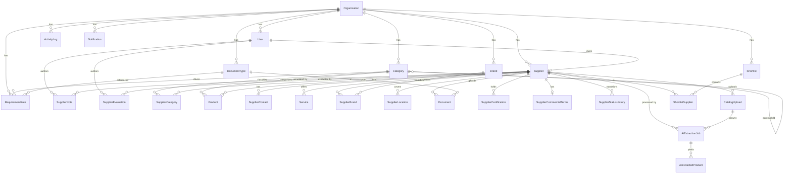

# Database

PostgreSQL, modeled with Prisma (`prisma/schema.prisma`). Normalized and multi-tenant —
every tenant-owned row carries `organizationId`, and application queries always scope by it.

## Entity-Relationship Diagram (core)

## Key tables

| Table | Purpose |
|-------|---------|
| `organizations` | Tenant boundary |
| `users` | Accounts with `UserRole` (SUPER_ADMIN / PROCUREMENT_ADMIN / PROCUREMENT_USER / SUPPLIER) |
| `suppliers` | Core supplier profile, `supplierCode` = `SUP-000001`, `status`, `completeness`, `rating`, AI hints |
| `categories` | Self-referencing taxonomy: level 0 Category → 1 Subcategory → 2 Product Group |
| `products` / `services` / `supplier_brands` / `supplier_locations` | Supplier offering & coverage |
| `documents` + `document_types` | DMS with `issueDate`/`expiryDate`/`status` |
| `requirement_rules` | Category → required document mapping (dynamic requirements engine) |
| `supplier_status_history` | Immutable status transitions |
| `supplier_notes` / `supplier_evaluations` | Internal notes & 1–5 evaluations |
| `activity_logs` | Tenant audit trail |
| `catalog_uploads` / `ai_extraction_jobs` / `ai_extracted_products` | AI pipeline; extracted products need human approval |
| `shortlists` / `shortlist_suppliers` | Project shortlists |
| `notifications` | In-app notification center |

## Enums
`SupplierStatus` (REGISTERED, PROFILE_INCOMPLETE, SUBMITTED, UNDER_REVIEW, PREQUALIFIED,
APPROVED, CONDITIONAL, REJECTED, SUSPENDED, BLACKLISTED), `SupplierTypeEnum`,
`BrandRelationship`, `DocumentStatus`, `EvaluationOutcome`, `AiJobType`, `AiJobStatus`,
`NotificationType`.

## Notable indexes
- `suppliers (organizationId, status)`, `(organizationId, crNumber)`, `(organizationId, vatNumber)`
- `documents (status)`, `(expiryDate)` — powers expiry dashboards
- `activity_logs (organizationId, createdAt)`
- Unique: `suppliers (organizationId, supplierCode)`, `users (organizationId, email)`

## Migrations & seed
- `prisma/migrations/` holds the SQL. Apply with `npm run db:migrate` (dev) / `db:deploy` (prod).
- `prisma/seed.ts` uses a deterministic PRNG so runs are reproducible: 1 org, 4 demo users,
  10 categories (+ subcategories & product groups), 20 brands, 50 suppliers, 100 products,
  documents (some expiring/expired), varied statuses, notes, evaluations, and a shortlist.
